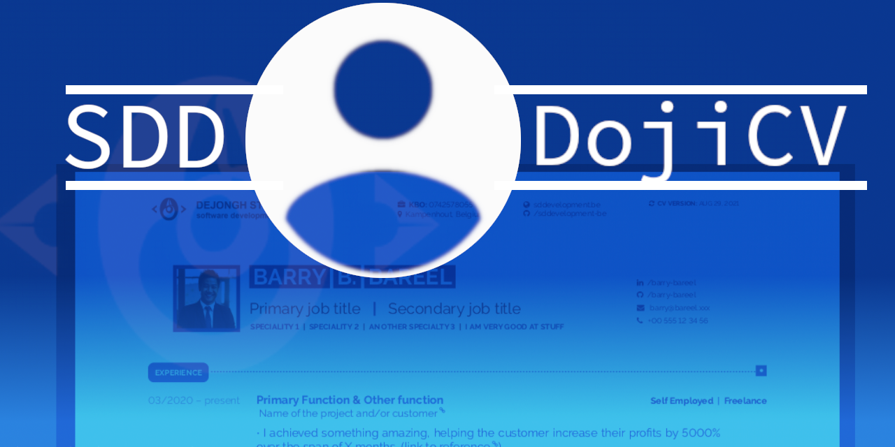

# DojiCV

A to-the-point LaTeX template for resumés, aimed to help you write a visually pleasing CV.
Writing an engaging Resume is not an easy task. This template will help you by providing you with a basic structure in which to enter your personal information.

Examples can be found in the [examples directory](./examples).
People starting out their professional carreer will be most interested in the spacious [playfull example](./examples/playful_example.pdf)
as it is meant to highlight your strengths and gives more focus to your educational achievements.

## Using this repository

### How it works

LaTeX is a text processor system. This means you will write your content in an encoded way, and let the processor take care of the layouting.
This system is often used in the IT sector, as it is easier to switch around your layout, without touching the content of your files.

- You will need a LaTeX processor on your computer. I recommend using [TeXLive](https://tug.org/texlive/)
- Next, you will need an editor in which to write your content. Personally, I use a combination of [neovim](https://neovim.io/) and [TeXStudio](https://www.texstudio.org/)

### Editing the template

In this repository, you will find two main files:

- **developercv.cls:** This is the LaTeX template file that defines how your CV will end up looking. Consider it the TeX equivalent of a CSS file in webdesign.
- **playful_example.tex / serious_example.tex:** These files contain the content and structure of your resume. They make use of the macro's and predefined controls that are included in the template file. You make your changes to these files.

### Building the CV

If you are using TeXLive, you can basically just click the "build" button at the top. The program will ask you to download various libraries.
You will need these in order to make the resume compilation work well. After the compilation has finished, you will end up with a PDF file.
Et voila, after some proofreading, your CV is ready to be sent out.

## Configuration options

You can use the included TEX file examples to inspire your use.
The most notable configuration options are:

- **The color of the CV:** you can choose between green and blue, or edit the template to include a color of your choice
- **Privacy toggle:** If you plan on publicly publishing your CV, it is wise to redact your contact information to avoid spam calls and mails
- **Corner style:** Choose between rounded or straight corners, or a combination of both
- **Company header:** Include you company information as a header on the CV. This can be useful for contractors, or for people applying for internal promotions
